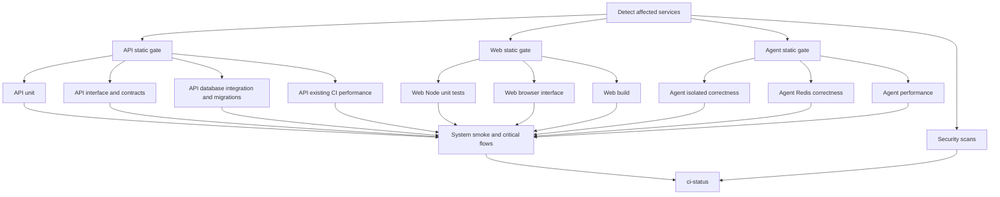

# Architecture

## Status

This document defines the enduring architectural reference for the Flight Booking System. It articulates the authoritative system topology, core architectural principles, subsystem boundaries, data models, and security invariants.

Runtime behavior must not be assumed implemented merely because it appears here. The single source of truth for active delivery status and verified task completion is:

- `context/progress-checker.md` (Current feature delivery status)
- `context/active-feature.md` (In-flight milestone checkpoints)

Historical feature narratives, commit logs, and per-task completion checklists (Features 001–029) are archived in `docs/history/architecture-archive.md`.

---

## CI Verification Boundaries

The PR pipeline separates static validation from unit, interface/component, infrastructure integration, and performance results. Suite commands and environment requirements are maintained in [testing.md](./testing.md). Changed services run all their required lanes; unchanged services skip them. `ci-status` is the only required branch-protection check and validates every applicable lane, security reports, and the system-flow result.



Infrastructure lives only in suites that need it. API database-backed HTTP tests are service integration; the composed system flow is separate. API wire contracts and component tests have distinct steps in one interface job. Smoke and critical flows share one startup and report separately. Previously required benchmarks remain required; the full API HTTP performance command and T093 browser acceptance remain explicit additional suites rather than newly required PR gates.

## System Topology

```text
┌───────────────────────────────────────────────────────────────────────────────────┐
│                                 Client Browser                                    │
│   (React Server Components + Thin Interactive Client Components / Zero Credential)│
└────────────┬─────────────────────────────┬───────────────────────────┬────────────┘
             │ Next.js Server Actions /    │ Same-Origin Route Handler │ SSE Stream
             │ Server Components           │ /api/booking-management/* │ (Port 3002)
             ▼                             ▼                           │
┌────────────────────────────────────────────────────────┐             │
│            Web Frontend — Next.js (Port 3000)          │             │
│  - App Router / React Server Components                │             │
│  - Single-Owner createBackendClient (Server Only)      │             │
│  - NextAuth Session & Private Bearer Token Resolution  │             │
└───────────────────────────┬────────────────────────────┘             │
                            │ Internal Server-to-Server                │
                            │ (Bearer JWT / Private VPC)               │
                            ▼                                          │
┌────────────────────────────────────────────────────────┐             │
│            Backend API — NestJS Monolith (Port 3001)   │             │
│  - Modular Monolith Architecture (Strict DAG)          │             │
│  - Supplier Boundary Narrowing (FLIGHT_SEARCH_PORT)   │             │
│  - DuffelCoreModule (SDK Singleton + Rate Budget)      │             │
│  - SupplierAncillaryModule (Catalog, Repricing, Seats) │             │
│  - AgentGatewayModule (API Key + HMAC Claim Tokens)    │             │
│  - PaymentFulfillmentSaga & Post-Commit Domain Events  │             │
│  - Prisma ORM & Transactional Integrity                │             │
└──────────────┬───────────────────┬───────────────────┬─┘             │
               │                   │                   │               │
      SQL / Tx │          Lua /    │ Capability Calls  │ HMAC Claims   │
               │          Cache    │ (Service Key)     │               │
               ▼                   ▼                   ▼               ▼
┌──────────────────┐    ┌─────────────────┐    ┌───────────────────────────────┐
│    PostgreSQL    │    │      Redis      │    │    Python Agent (Port 3002)   │
│  (Port 5432)     │    │  (Port 6379)    │    │  - FastAPI + LangGraph        │
│                  │    │                 │    │  - 4-Stage Admission Pipeline │
│ - Users / Auth   │    │ - Search Hashes │    │  - Pure Pydantic Events       │
│ - Bookings / PNR │    │ - Rate Budgets  │    │  - GraphEventInterpreter      │
│ - Flight Offers  │    │ - Seat Maps     │    │  - ToolResultResolver         │
│ - Payment Ledger │    │ - Session Locks │    │  - SSE Transport Formatter    │
│ - Revisions      │    │ - Turn Quotas   │    └───────────────┬───────────────┘
│ - Audit Logs     │    └─────────────────┘                    │
└──────────────────┘                                           │
         ▲                                                     │
         │ Upstream Fulfillment / Status                       │
         ├─────────────────────────────────┐                   │
         ▼                                 ▼                   ▼
┌─────────────────┐             ┌─────────────────┐  ┌──────────────────┐
│   Duffel API    │             │   Stripe API    │  │ Mimo / OpenAI API│
│ (Restricted     │             │ (Payment Intent │  │ (LLM Inference   │
│  Ports Only)    │             │  & Webhooks)    │  │  Reasoning Engine│
└─────────────────┘             └─────────────────┘  └──────────────────┘
```

The system strictly decouples conversational reasoning from transactional authority. Browser clients never communicate directly with backend supplier APIs or Python services for transactional mutations. All transactional workflows terminate at the NestJS backend monolith.

---

## Stack

| Layer                  | Technology           | Version / Tooling                     | Architectural Role                                                       |
| ---------------------- | -------------------- | ------------------------------------- | ------------------------------------------------------------------------ |
| **Runtime & Language** | TypeScript / Node.js | TypeScript 5.4+, Node.js 20+ LTS      | Strict typing monorepo core (`@shared/types`, API, Web)                  |
| **Agent Runtime**      | Python               | Python 3.12+, uv package manager      | High-performance AI service runtime (`apps/agent`)                       |
| **Web Tier**           | Next.js              | Next.js 14 (App Router)               | Server-first rendering, thin client components, zero-credential boundary |
| **Backend API**        | NestJS               | NestJS 10, Express, class-validator   | Modular monolith, domain boundary enforcement, saga orchestration        |
| **AI Agent Service**   | FastAPI / LangGraph  | FastAPI, LangGraph v2, Pydantic v2    | Conversational workflow graph, streaming SSE event translation           |
| **Persistence**        | PostgreSQL           | PostgreSQL 16 via Prisma ORM 5.x      | ACID transactional store, optimistic concurrency, relational schema      |
| **Cache & State**      | Redis                | Redis 7 via ioredis & redis-py        | Distributed rate budgeting, session locks, cached catalog snapshots      |
| **Suppliers**          | Duffel API           | `@duffel/api` SDK (narrowed provider) | Upstream flight search, seat maps, baggage, and booking orders           |
| **Payments**           | Stripe               | Stripe Node SDK, Stripe Elements      | PCI-compliant card tokenization, Payment Intents, webhook ingestion      |
| **Shared Contracts**   | Monorepo Shared      | Zod 3.x, npm workspaces / pnpm        | Single source of truth for DTO schemas, domain models, constants         |

---

## Core Architectural Principles

### 1. LLM = Reasoning Component / Runtime = Authority

The Large Language Model is strictly a stateless reasoning component. It possesses zero execution authority and is never treated as a privileged security perimeter.

- All model actions cross deterministic runtime gates: schema validation, capability checks, session-state verification, and policy bounds.
- The model never executes direct SQL queries, mutates database records, or triggers payment rails directly.
- All operations execute through capability endpoints on the NestJS `AgentGatewayModule`, which independently validates identity, user permissions, and idempotency.

```text
Model Tool Request ──► Schema Validation ──► Capability Check ──► Policy Evaluation ──► Execution ──► Sanitization ──► Client
```

### 2. Zero-Client-Credential Boundary

Browser runtimes and client-side JavaScript bundles must never hold or observe supplier credentials, private service keys, backend bearer JWTs, or private network URLs.

- Next.js Client Components (`"use client"`) never receive `accessToken`, `API_URL`, or secret environment variables via props, hooks, or hidden DOM inputs.
- Authentication tokens are resolved exclusively on the server (via Server Components, Server Actions, or server-only modules via `getServerSession`).
- Interactive client actions route through Server Actions or thin same-origin route handlers (`/api/booking-management/*`) delegating to server domain modules.

### 3. Ports & Adapters / Supplier Boundary Narrowing

The core flight domain remains strictly vendor-blind. External travel suppliers (e.g., Duffel) are strictly encapsulated behind narrow, intention-revealing ports:

- `SupplierSearchModule` exports solely the `FLIGHT_SEARCH_PORT` injection token (`FlightSearchPort`). Domain consumers (`FlightsService`, `FlightSearchOrchestratorService`, `BookingIntentService`, `BookingReadinessService`, `BookingPassengerFinalValidatorService`, `ChatHandoffService`) consume strictly canonical `FlightOffer` objects and normalized travel scope, completion, expiry, and passenger provenance facts (T059, T060, T063). Live domain raw-offer parsing is retired; `FlightSearchOrchestratorService` accepts and returns only canonical offers (T064).
- Raw offer-to-booking snapshot conversion is relocated to the supplier search boundary (`FlightOfferNormalizer`), passing normalized snapshots into lifecycle creation so that `BookingStateModule` depends solely on Prisma and DomainEvents without vendor-specific payload interpretations (T061).
- `SupplierAncillaryModule` encapsulates supplier-specific catalog ingestion, seat map availability, and repricing behind `DuffelAncillaryService`.
- Order calls flow through the existing `FULFILLMENT_GATEWAY_PORT` binding. `DuffelOrderAdapter` handles metered manual order POST, quote, confirmation, cancellation, and retrieval using shared core configuration. `SupplierOrderModule` owns the order services and fulfillment binding; T042 removed the legacy `DuffelService`/`DuffelModule` monolith and rewired search to its injected SDK. Cancellation outcomes and passenger enrichment are normalized strictly within `SupplierOrderModule` (`OrderSnapshotNormalizer`), removing all supplier-shape interpretations from `BookingRecoveryService` (T062).
- Internal cancellation quote ID parsing and serialization helpers and types use Supplier vocabulary (`ParsedSupplierCancellationQuoteId`, `parseSupplierCancellationQuoteId`, `serializeSupplierCancellationQuoteId`), while preserving explicit wire DTO aliases (`ParsedDuffelCancellationQuoteId`, `duffelCancellationQuoteId`) for client compatibility (T065).
- `DuffelCoreModule` owns the `@duffel/api` SDK singleton (`DUFFEL_SDK`), validated configuration, and shared budget. Search, ancillary, and order capability modules explicitly import it; it is not global. The core module test verifies an unrelated module cannot resolve `DUFFEL_SDK`. Domain modules must not consume raw supplier types or SDK instances.

```text
Domain Consumer (FlightsService / BookingIntentService)
      │
      ▼  (Normalized FlightOffer)
FLIGHT_SEARCH_PORT (Interface Token)
      │
      ▼
DuffelSearchService (Criteria Normalization & Cache Hit Check)
      │
      ├──► Cache Hit: Returns cached FlightOffer (0 budget reservations, 0 SDK calls)
      │
      └──► Cache Miss: DuffelSearchAdapter
                │
                ├──► DuffelRateBudgetService (Atomic Redis check-and-increment)
                │
                └──► Duffel SDK Singleton (DUFFEL_SDK) ──► Upstream Duffel API
```

### 4. Fail-Closed Security & Atomic Daily Rate Budgets

Supplier rate limiting enforces financial and operational protection against downstream quota depletion:

- Redis Lua scripts evaluate primary daily counter (`budget:duffel:daily:YYYY-MM-DD`) and optional caller sub-allocation counters (`budget:duffel:caller:{user|agent}:YYYY-MM-DD`) in a single atomic round-trip.
- Key initialization atomically attaches an expiration TTL set to the next UTC midnight (`00:00:00Z`).
- Attempted-call semantics: Budget permits are reserved prior to dispatching upstream supplier calls. Zero refund or decrement methods exist.
- Fail-closed behavior: Any budget denial or Redis operational failure immediately yields HTTP 429 (`RATE_LIMIT_EXCEEDED` or `BUDGET_UNAVAILABLE`) with 0 upstream supplier calls.

```text
Caller Request
      │
      ▼
Check & Increment (Redis Lua Script)
      │
      ├──► Both limits within budget ──► Allow (1 attempt reserved) ──► Invoke Duffel SDK
      │
      ├──► Counter exceeds budget   ──► Reject (0 SDK calls) ───────► HTTP 429 BUDGET_UNAVAILABLE
      │
      └──► Redis Error / Timeout    ──► Fail-Closed In-Memory Guard  ► HTTP 429 BUDGET_UNAVAILABLE
```

### 5. Idempotent & Atomic Booking Fulfillment

Flight ticket purchase requires multi-party state convergence across local databases, Stripe, and airline suppliers:

- Two-phase booking flow: Hold/Intent Creation ──► Stripe Payment Authorization ──► Supplier Order Creation ──► Atomic Finalization.
- Orchestrated by `PaymentFulfillmentSaga` using bounded semaphore permits (Stripe: 20 active / 100 queued; Duffel: 10 active / 100 queued; 5,000 ms deadline) and idempotency locks. Transactions are never held open across external HTTP calls.
- Atomic state transitions: Updates increment `Booking.version` optimistically. Domain events (`booking.confirmed`, `booking.cancelled`) dispatch strictly post-commit via `EventEmitterModule`.
- Eventual consistency: Background projection workers synchronize read models (`BookingAgentProjection`) without blocking critical write paths.

```text
Client Confirm ──► PaymentFulfillmentSaga ──► Stripe Adapter (Charge) ──► Duffel Fulfillment (Order)
                          │                                                        │
                          ▼                                                        ▼
                   Database Commit ◄───────────────────────────────────────────────┘
                   (Booking.version++, Status=CONFIRMED)
                          │
                          ▼ (Post-Commit Dispatch)
                   Domain Events (booking.confirmed) ──► BookingProjectionModule (Async Read-Model)
```

---

### Feature 030 durable journal foundation (Phase 2)

The API now persists a FulfillmentWorkflow claim row, stable ProviderOperation identities, and per-dispatch ProviderAttempt records. Payment also has an internal RESERVED state, a nullable unique Stripe PaymentIntent ID, and nullable provider-operation/attempt links on PaymentEvent.

FulfillmentWorkflowRepository claims and renews a workflow using PostgreSQL clock_timestamp(), owner tokens, and monotonic fences. Fenced transactions recheck ownership and lease expiry after their callback, so an expired callback rolls back. ProviderOperationService reserves Payment and records PREPARED operation/attempt state before dispatch; later provider evidence is append-only and cannot downgrade terminal outcomes.

PaymentFulfillmentModule owns and exports the repository and operation service. PaymentService has an optional constructor-injected operation service and preserves the existing API projection: RESERVED appears as PENDING, and missing provider IDs are omitted.

This is persistence, claim fencing, journal behavior, and dependency wiring only. Recovery remains disabled by default; production requests are not yet routed through these journal operations, and no provider side effect is issued from their database callbacks. The test-only controlled harness is implemented through T010–T016: isolated provider simulators and driver credentials, per-run database/Redis resources, virtual scheduling, and owned real Next/Nest startup, health checks, and teardown. Its passing startup smoke does not establish customer checkout or recovery acceptance; see the [Phase 2 verification record](../specs/030-fulfillment-recovery-acceptance/verification-phase2.md).

## Project Structure

```text
c:/Booking Systems/
├── apps/
│   ├── api/                                # NestJS Monolithic Backend (Port 3001)
│   │   ├── prisma/
│   │   │   ├── schema.prisma               # Authoritative PostgreSQL relational schema
│   │   │   └── migrations/                 # Version-controlled DB migrations
│   │   └── src/
│   │       ├── agent-gateway/              # Hardened capability endpoints for AI agent
│   │       ├── ancillaries/                # Domain ancillary catalog & validation
│   │       ├── auth/                       # JWT authentication, guards & strategies
│   │       ├── booking-intent/             # Initial offer locks & pricing holds
│   │       ├── booking-lifecycle/          # State machines, transitions & recovery
│   │       ├── booking-management/         # User booking operations & cancellation
│   │       ├── booking-projection/         # Event-driven async read-model projections
│   │       ├── cache/                      # Redis client, Lua scripts & rate budgeting
│   │       ├── cancellation/               # Cancellation quotes, policies & execution
│   │       ├── disruption/                 # Schedule changes, alerts & passenger inbox
│   │       ├── domain-events/              # Post-commit passive event infrastructure
│   │       ├── duffel/                     # Retained Duffel wire compatibility types
│   │       ├── flights/                    # Search orchestration, scoring & rankings
│   │       ├── payment/                    # Payment intents, Stripe webhooks & ledger
│   │       ├── payment-fulfillment/        # PaymentFulfillmentSaga & supplier orders
│   │       ├── supplier/                   # Ports & adapters (search, ancillary, order, shared core)
│   │       └── main.ts                     # NestJS bootstrap, global pipes & filters
│   │
│   ├── agent/                              # Python Conversational Agent (Port 3002)
│   │   ├── src/agent/
│   │   │   ├── admission/                  # 4-stage sequential admission pipeline
│   │   │   ├── chat_turn/                  # Pure Pydantic events, interpreter & resolver
│   │   │   ├── graph/                      # LangGraph v2 workflow definitions
│   │   │   ├── guardrails/                 # Prompt injection scans & input safety
│   │   │   ├── memory/                     # Conversation history & thread state
│   │   │   ├── streaming/                  # SSE wire formatting (format_sse)
│   │   │   ├── tools/                      # Agent tool definitions (gateway callers)
│   │   │   └── main.py                     # FastAPI application & lifespan management
│   │   └── tests/                          # Pytest suite & synthetic graph fixtures
│   │
│   └── web/                                # Next.js Web Frontend (Port 3000)
│       ├── app/
│       │   ├── (auth)/                     # Login, signup & profile routes
│       │   ├── api/booking-management/     # Thin same-origin route handlers
│       │   ├── bookings/                   # Booking management & revision history UI
│       │   ├── search/                     # Flight search controls & results views
│       │   └── layout.tsx                  # Root shell & navigation
│       ├── components/                     # React Server Components & UI primitives
│       └── lib/server/
│           ├── backend-client.ts           # Single-owner resilient HTTP client
│           └── booking-management.ts       # Server domain dispatcher for route handlers
│
├── packages/
│   └── shared/                             # Cross-package shared types and constants
│       ├── src/
│       │   ├── constants/                  # Match thresholds, timeouts, cache keys
│       │   ├── schemas/                    # Zod validation schemas
│       │   └── types/                      # Domain interfaces, outcomes & DTO contracts
│       └── package.json
│
├── docs/history/                           # Archived milestone logs & historical specs
└── context/                                # Enduring developer & agent context files
```

---

## Core Subsystems

### 1. Backend API (NestJS Monolith)

The backend functions as an anti-cyclic modular monolith where all domain interactions follow strict acyclic dependency graphs (DAG) without circular imports or `forwardRef()` workarounds:

- **`SupplierSearchModule`**: Encapsulates `DuffelSearchService`, `DuffelSearchAdapter`, `FlightOfferNormalizer`, and `FlightOfferCleanupService`. Exports solely `FLIGHT_SEARCH_PORT`. Normalizes supplier offers to RFC 4122 v4 deterministic UUID-identified `FlightOffer` structures, manages daily TTL purges, and normalizes travel scope, completion, expiry, and passenger provenance facts (T059). Relocated raw offer-to-booking snapshot conversion (`mapOfferToBookingSnapshots`) to this boundary so `BookingStateModule` and booking lifecycle depend exclusively on Prisma and DomainEvents (T061).
- **`FlightSearchOrchestratorService`**: Consumes and returns strictly canonical `FlightOffer` objects; the live domain raw-offer parser has been retired, preserving ranking, scoring, top-20 selection, currency, and identity parity through canonical structures (T064).
- **`SupplierAncillaryModule`**: Houses `DuffelAncillaryAdapter`, `AncillaryNormalizer`, and `DuffelAncillaryService`. Retrieves seat maps and ancillary catalogs concurrently after reserving both catalog attempts sequentially, preserving legacy admission behavior under budget denial, with a strict 4,500 ms deadline. Safely translates missing seat maps (`meta.status=404`) into empty maps while preserving baggage, aggregates duplicate seat/baggage quantities, and enforces supplier-authoritative repricing totals.
- **`DuffelCoreModule`**: Hosts the verified `@duffel/api` SDK singleton (`DUFFEL_SDK`), validates URL protocol and environment variables, and provides `DuffelRateBudgetService` for shared quota governance. Only supplier capability modules import it; its providers are not globally visible.
- **Supplier order services (T035–T042, T062, T065)**: `OrderSnapshotNormalizer` owns order-to-flight/passenger snapshot, ordered itinerary mapping, cancellation outcome normalization, and passenger enrichment; legacy snapshot mapping remains compatible without a `DuffelService` runtime dependency. `DuffelCancellationService` constructor-injects the metered `DuffelOrderAdapter`, preserves quote extensions and confirmation/refund status, and reconciles a failed cancellation through an explicitly cancelled order. Budget denial starts no reconciliation; failed or active-order reconciliation preserves the original error. `DuffelRecoveryService` injects the same adapter and normalizer, preserves raw complete-order retrieval and existing cancellation status, and recovers legacy-compatible snapshots with one metered retrieval. Its synchronous `mapOrderToSnapshots` normalizes already-persisted order evidence without another supplier call, removing all supplier-shape interpretations from `BookingRecoveryService` (T062). Cancellation quote ID parse/serialize helpers and types use Supplier vocabulary (`ParsedSupplierCancellationQuoteId`, `parseSupplierCancellationQuoteId`, `serializeSupplierCancellationQuoteId`) with legacy wire aliases preserved (T065). `SupplierOrderModule` owns and exports cancellation, recovery, and `FULFILLMENT_GATEWAY_PORT`; cancellation, booking recovery, disruption sync, and payment fulfillment import that boundary. `AppModule` registers supplier capability modules directly; T042 removed `DuffelModule` and the monolith. The T039 graph E2E exercises real consumers and a safe order/cancellation flow with external SDK/cache/fetch doubles.
- **`AgentGatewayModule` & Chat Handoff**: Decomposed into capability-local submodules (`AttestedFlightSearchModule`, `AgentBookingReadinessModule`, `SafeBookingReadModule`, `TravelerPreferencesModule`). Authenticates agent requests via `AGENT_SERVICE_API_KEY` and short-lived user-bound HMAC claim tokens. Direct database access from agents is strictly prohibited. `ChatHandoffService` consumes normalized freshness and passenger-provenance facts through `FLIGHT_SEARCH_PORT` instead of reading raw supplier expiry or passenger shapes (T063).
- **Booking Intent & Lifecycle Validation**: `BookingPassengerFinalValidatorService` injects `FLIGHT_SEARCH_PORT` and evaluates supplier-normalized travel/expiry facts without raw evidence inspection, preserving decrypt-first ordering and passport/trip-date safeguards (T060). `BookingStateModule` isolates database transitions; `BookingLifecycleModule` manages recovery workflows; `PaymentFulfillmentSaga` drives asynchronous supplier confirmation; `BookingProjectionModule` writes denormalized read-models (`BookingAgentProjection`) asynchronously via `booking.**` domain events. Cancellation requires explicit valid confirmation; pending, negative, invalid, and non-JSON outcomes remain unconfirmed, preserving the processing booking, authorized hold, and order evidence. Recovery accepts nonempty order IDs from top-level or nested order evidence, defers missing or malformed IDs, and returns safely when payment-event lookup fails. It records cancellation only from explicit provider confirmation, never from error text. `RATE_LIMIT_EXCEEDED` and `BUDGET_UNAVAILABLE` use valid positive retry seconds and upstream reset time when available; other failures use a 300-second backoff. Deferral cache-write failures preserve the booking and hold.
- **Domain Events Backbone**: Built on `EventEmitterModule.forRoot()` registered once in `AppModule`. Domain events are passive, behavior-free DTO envelopes containing typed primitives. Dispatched strictly after transaction commit; async listeners catch their own failures without invalidating committed database state.

### 2. Python Agent Service (FastAPI / LangGraph)

The AI agent provides conversational trip planning, preference matching, and guided checkout assistance over real-time SSE streams:

- **Pure Pydantic `ChatTurnEvent`**: Strict discriminated union defining 8 canonical wire events (`token`, `tool_call`, `tool_result`, `flight_results`, `ACTION_HANDOFF`, `ACTION_REQUIRED`, `done`, `error`) completely isolated from transport logic.
- **`GraphEventInterpreter`**: Pure async generator stream translator that converts raw LangGraph v2 streaming events into domain `ChatTurnEvent` items. It is completely tool-name agnostic (zero hardcoded tool name checks) and raises typed `ProjectionBlockedException` fail-closed if unapproved operations occur.
- **`ToolResultResolver`**: Pure domain projection engine transforming validated tool completions and handoff node outputs into strongly typed `ToolResolution` and `HandoffResolution` instances.
- **Ordered Admission Pipeline**: Every chat turn executes through a 4-stage sequential admission sequence before entering graph execution:
  1. `AuthService`: Verifies incoming client request authentication and user identity.
  2. `InputAdmissionService`: Scans user input for prompt injections, jailbreaks, and sensitive data.
  3. `QuotaService`: Reserves daily user turn allocations in Redis.
  4. `TurnSessionCoordinator`: Acquires a distributed Redis session lock (`session:lock:${sessionId}`) with background heartbeat to prevent concurrent race conditions.
- **Streaming Transport**: `format_sse` serializes Pydantic domain events directly into HTTP/1.1 chunked text/event-stream envelopes.

| Wire Event        | Payload Signature                                   | Architectural Role                                         |
| ----------------- | --------------------------------------------------- | ---------------------------------------------------------- |
| `token`           | `{ text: string }`                                  | Incremental LLM token streaming to client                  |
| `tool_call`       | `{ id: string, name: string, input: object }`       | Notification of proposed tool execution                    |
| `tool_result`     | `{ id: string, result: object }`                    | Deterministic outcome of capability call                   |
| `flight_results`  | `{ offers: FlightOffer[] }`                         | Structured flight search payload projection                |
| `ACTION_HANDOFF`  | `{ handoffToken: string, bookingIntentId: string }` | Transition token for authenticated UI checkout             |
| `ACTION_REQUIRED` | `{ action: string, context: object }`               | Client confirmation gate before critical state transitions |
| `done`            | `{ totalTokens?: number }`                          | Normal termination of the conversational turn              |
| `error`           | `{ message: string, code: string }`                 | Fail-closed error delivery without leaking traces          |

### 3. Web Frontend (Next.js)

The frontend operates on Next.js 14 App Router, prioritizing React Server Components and centralizing all server-to-server backend communication:

- **Single-Owner `backend-client.ts` (`createBackendClient`)**: Encapsulates all HTTP operations from Next.js server code to the NestJS backend.
- **Strict GET Retries**: Automatically retries idempotent GET requests up to 3 attempts on transient network failures or gateway errors (502, 503, 504), adhering to upstream `Retry-After` headers on 429 responses. Configured with `ATTEMPT_TIMEOUT_MS = 10_000` and `TOTAL_TIMEOUT_MS = 31_000`.
- **Single-Send Fast-Fail Mutations**: Non-idempotent mutations (POST, PUT, PATCH, DELETE) are executed exactly once. Network drops or server errors fail fast without automatic retry, preventing double-billing or duplicate booking intents.
- **Thin Route Handlers (`app/api/booking-management/*`)**: 7 minimal route handlers (`force-dynamic`, `private, no-store`) delegating 100% of execution to server domain module `booking-management.ts` to shield backend topology from client browsers.
- **Zero Credential / Token Logging**: Centralized redaction (`redactSensitive`) guarantees that bearer tokens, user session secrets, and customer PII are never logged to console streams or diagnostics.
- **Typed Outcome Responses**: All client operations return discriminated `TransportResult<T>` unions (`{ ok: true, data }` or `{ ok: false, kind, ... }`), ensuring components handle failure states exhaustively.

---

## Data & Persistence Topology

### PostgreSQL Entities (Prisma Relational Schema)

- **`User` & `TravelerProfile`**: User identities, authentication records, saved travel preferences (airlines, seating, dietary), and role authorization.
- **`Booking` & `BookingIntent`**: Authoritative booking records containing PNR, booking status (`PENDING`, `CONFIRMED`, `CANCELLED`), flight snapshots, and optimistic concurrency version counters (`Booking.version`).
- **`FlightOffer` & `SearchHistory`**: Normalized flight search options stored with search query hashes, expiration timestamps, and raw JSONB supplier evidence for non-repudiation.
- **`Passenger` & Ancillary Selections**: Passenger identity documents, seat selections (`SeatSelection`), and baggage assignments (`BaggageSelection`).
- **`Payment` & `LedgerEntry`**: Stripe payment intent references, amount, currency, transaction status, refund obligations (`CancellationRefundObligation`), and immutable financial ledger entries.
- **`ItineraryRevision` & `DisruptionAuditEvent`**: Immutable flight schedule modifications, airline notifications, passenger acknowledgment flags, and historical itinerary segments.
- **`BookingAgentProjection`**: Read-optimized denormalized booking representation consumed by the AI agent gateway, hydrated asynchronously via post-commit domain events.
- **`ChatSession`, `ChatMessage` & `ChatHandoff`**: Conversational session history, serialized thread messages, tool invocation logs, and handoff tokens.

### Redis Topology

| Cache Domain / Key Pattern              | TTL Policy                    | Eviction / Invalidation Behavior | Purpose                                                             |
| --------------------------------------- | ----------------------------- | -------------------------------- | ------------------------------------------------------------------- |
| `flight:search:${searchHash}`           | 15–30 minutes                 | Natural TTL expiration           | Caches normalized search results; hits consume 0 supplier budget    |
| `ancillary:catalog:${offerId}`          | 60 seconds                    | Stale if remaining TTL < 3s      | Caches seat maps and ancillary baggage per active flight offer      |
| `budget:duffel:daily:YYYY-MM-DD`        | Next UTC midnight (00:00:00Z) | Daily rollover                   | Global daily rate budget counter (default 1,500 attempts)           |
| `budget:duffel:caller:user:YYYY-MM-DD`  | Next UTC midnight (00:00:00Z) | Daily rollover                   | Caller sub-allocation for direct user interactions (1,000 attempts) |
| `budget:duffel:caller:agent:YYYY-MM-DD` | Next UTC midnight (00:00:00Z) | Daily rollover                   | Caller sub-allocation for AI conversational turns (500 attempts)    |
| `booking:recovery:defer:{bookingId}`    | Until retry time               | Expires by TTL                    | Stores only the next allowed UTC retry timestamp; positive TTL skips the 10-minute sweeper, and a missing key permits a safe retry |
| `session:lock:${sessionId}`             | 30 seconds                    | Heartbeat refreshed during turn  | Distributed lock preventing concurrent conflicting turns            |
| `chat:quota:${userId}:${YYYY-MM-DD}`    | Next UTC midnight (00:00:00Z) | Daily rollover                   | Enforces per-user daily conversational turn limits                  |
| `agent:search:snapshot:${snapshotId}`   | 30 minutes                    | Natural TTL expiration           | Preserves trusted search context for agent tool flight references   |

---

## Communication & Security Architecture

### Inter-Service Protocols

- **Web Frontend ──► Backend API**: Authenticated via private Bearer JWTs generated by NextAuth and injected exclusively on the server by `createBackendClient`. Client browser interacts via Server Actions or thin same-origin route handlers.
- **Web Frontend ──► Agent Service**: Direct HTTP/1.1 chunked Server-Sent Events (SSE) streaming conversational tokens and structured tool updates.
- **Agent Service ──► Backend Gateway**: Private server-to-server HTTP channel secured with dual credentials:
  1. `AGENT_SERVICE_API_KEY`: Verifies service-level identity.
  2. HMAC-SHA256 Claim Token (`CLAIM_TOKEN_SECRET`): Time-bounded cryptographic token proving user delegation for the active session, validated by `AgentGatewayGuard`.

### Trust Model

```text
┌──────────────────────────────┐       ┌──────────────────────────────┐       ┌──────────────────────────────┐
│       UNTRUSTED ZONE         │       │     SEMI-TRUSTED ZONE        │       │       TRUSTED ZONE           │
│ - Client Web Browser         │ ───►  │ - LLM Generation Output      │ ───►  │ - NestJS Backend Monolith    │
│ - External User Prompts      │       │ - Agent Tool Call Proposals  │       │ - PostgreSQL Database        │
│ - Raw Supplier Webhook Hooks │       │ - Raw Ingested Supplier JSON │       │ - Redis Cluster              │
└──────────────────────────────┘       └──────────────────────────────┘       └──────────────────────────────┘
```

### Guardrail & Injection Boundary

- **Input Screening**: All incoming user turns are scanned by `InputAdmissionService` using deterministic pattern matchers and safety filters before prompt interpolation.
- **PII Scrubbing**: Centralized sanitization strips credit card numbers (PANs), social security identifiers, and raw authorization secrets before persisting audit logs or transmitting context to LLMs.
- **Tool Argument Gatekeeping**: Tool calls emitted by the reasoning model are strictly validated against Pydantic schemas in `ToolResultResolver` before capability requests are dispatched to the backend gateway.

---

## Failure & Outcome Model

The platform avoids leaking raw runtime exceptions, database error codes, or vendor SDK stack traces to users or clients. All errors are classified into explicit, strongly typed domain outcomes:

| Outcome Code                  | HTTP Status | Trigger Condition                                           | System Behavior                                          |
| ----------------------------- | ----------- | ----------------------------------------------------------- | -------------------------------------------------------- |
| `RATE_LIMIT_EXCEEDED`         | 429         | Per-user request frequency or turn limit exceeded           | Bounded reject with `Retry-After` header                 |
| `BUDGET_UNAVAILABLE`          | 429         | Global or caller daily supplier budget exhausted            | Fails closed; zero upstream supplier calls dispatched    |
| `OFFER_EXPIRED`               | 410 / 409   | Airline fare expired or seat availability lost              | Prompts user to refresh search; invalidates cached hold  |
| `UNAUTHENTICATED`             | 401         | Missing, invalid, or expired JWT or HMAC claim token        | Terminates request; forces re-authentication             |
| `FORBIDDEN`                   | 403         | Attempt to read or modify a resource owned by another user  | Access denied; audit event emitted                       |
| `UPSTREAM_UNAVAILABLE`        | 503         | External supplier (Duffel/Stripe) returned 5xx or timed out | Retries idempotent calls; returns safe degraded response |
| `GUARDRAIL_BLOCKED`           | 400         | Prompt injection or policy violation detected in turn       | Aborts agent turn; returns safe refusal response         |
| `ANCILLARY_CURRENCY_MISMATCH` | 400         | Ancillary service currency does not match base offer        | Rejects selection; requires currency consistency         |
| `STALE_REVISION`              | 409         | Optimistic concurrency conflict on `Booking.version`        | Rejects mutation; prompts client to reload latest state  |

---

## Historical Reference

This architecture represents the current consolidated state of the Flight Booking System. For chronological development milestones, feature implementation plans, and completed task breakdown logs (Features 001 through 029), refer to:

- **`docs/history/architecture-archive.md`**: Complete historical commit logs and feature specifications.
