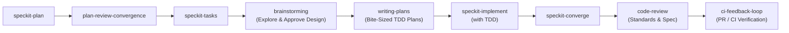

# Development Workflow

The mandatory workflow that all AI agents must follow when building features in this project. Every feature goes through this pipeline in order. No step may be skipped.

---

## Workflow Pipeline

```
speckit-plan → plan-review-convergence → speckit-tasks → brainstorming → writing-plans → speckit-implement (with TDD) → speckit-converge → code-review → ci-feedback-loop
```



> **Pipeline Stages**: Plan Quality Gate (`plan-review-convergence`) → Design Refinement & Task Planning (`brainstorming`, `writing-plans`) → TDD Implementation (`speckit-implement`) → Post-Implementation Convergence (`speckit-converge`) → Dual-Axis Quality Sign-Off (`code-review`) → PR / CI Convergence (`ci-feedback-loop`).

---

## Step 1: Plan (`/speckit-plan`)

**Purpose**: Create a detailed implementation plan — architecture, file structure, services, function signatures, data model changes.

The agent must:

1. Understand the feature requirements and architectural boundaries.
2. Produce a `plan.md` with technical decisions, file-by-file breakdown, and implementation approach, ensuring alignment with project architecture and code standards.

**Gate**: Plan produced, but not yet approved — it goes through convergence review first.

---

## Step 2: Plan Review Convergence (`/plan-review-convergence`)

**Purpose**: Cross-AI review of the plan to catch high-priority issues before any code is written.

The agent must:

1. Run the `plan-review-convergence` skill to review the plan with external AI reviewers.
2. Identify and resolve all HIGH and CRITICAL issues found in the plan.
3. Replan if necessary — the convergence loop continues until no unresolved HIGH issues remain.
4. Produce a converged plan that has been stress-tested from multiple angles.

**Gate**: Plan must converge (no unresolved HIGH/CRITICAL issues) before proceeding. User must approve the converged plan.

---

## Step 3: Generate Tasks (`/speckit-tasks`)

**Purpose**: Break the converged plan into an actionable, dependency-ordered task list.

The agent must:

1. Read the converged plan.
2. Produce a `tasks.md` with phased tasks, dependencies, and file paths.
3. Tasks must be granular enough for vertical-slice TDD — each task should map to a testable behavior.

**Gate**: User may review tasks before implementation.

---

## Step 4: Brainstorming (`/brainstorming`)

**Purpose**: Turn slice or feature designs into structured, validated approaches before touching code.

The agent must:

1. **Classify the path**:
   - **Spike**: Feasibility inquiry with throwaway experiments (2–3 sentence probe plan, user nod).
   - **Bounded**: Scoped change to existing code/flow (ask clarifying questions, present short in-chat design, wait for approval).
   - **Architectural**: New subsystems, features, or interface restructuring (full exploration, 2–3 approaches with trade-offs, sectioned design, user approval per section).
2. **Explore Context & Intent**: Inspect files, docs, and recent commits. Ask focused clarifying questions one at a time.
3. **Propose Approaches**: Provide 2–3 options with explicit trade-offs and a clear recommendation.
4. **Hard Gate**: Do NOT invoke implementation skills or write code until the user gives explicit approval on the design.

---

## Step 5: Writing Plans (`/writing-plans`)

**Purpose**: Structure the approved design into a comprehensive, bite-sized, TDD-actionable implementation plan before writing any production code.

The agent must:

1. **Map File Structure & Boundaries**: Define exact file responsibilities, inputs, and outputs to maintain clean, deep module seams.
2. **Structure Bite-Sized TDD Tasks**:
   - Each step is a 2–5 minute focused action: Write failing test (RED) → Verify failure → Write minimal code (GREEN) → Verify pass → Commit.
   - Define exact consumed and produced interfaces for each task.
3. **Eliminate Placeholders**: Strictly no "TODO", "TBD", or vague instructions. State required behavior, explicit interfaces, test commands, and observable acceptance criteria; include code snippets only when the approved design requires an exact stable declaration.
4. **Self-Review Checklist**: Skim against plan coverage, placeholder scan, and type consistency across tasks.

**Gate**: Comprehensive plan produced and self-reviewed before task execution.

---

## Agent Coordination: Task Briefs, Handoffs, and Reviews

Keep `specs/<feature>/tasks.md` as the sole task-status ledger. Treat its first unchecked task as the resume candidate when the user's existing authorization covers that feature; the ledger does not grant new approval or bypass the design and workflow gates above. Keep evidence in its canonical verification record instead of copying task-status tables into handoff prose.

### Dispatch a task

For feature work, give each implementer one or two original task IDs; for maintenance work, name the approved user goal instead of borrowing a feature ID. Link the plan and name its exact section when one exists; quote only the contract needed, not the full plan. Point to relevant exported interfaces, name owned source files and generated artifacts, identify prerequisite outputs for dependent work, and state observable behavior, focused commands, and acceptance criteria. Link the relevant `AGENTS.md` guardrail, `context/code-standards.md`, and `context/testing.md` sections instead of pasting their full rules. Preserve the approved design and TDD cycle; describe required behavior and contracts rather than prescribing production code before implementation.

Use the repository task commands to derive a handoff from the canonical ledger and plan:

```powershell
pnpm agent:context handoff --tasks specs/<feature>/tasks.md [--root <checkout>]
pnpm agent:context task --tasks specs/<feature>/tasks.md --task <task-id> [--plan specs/<feature>/plan.md] [--root <checkout>]
```

Replace `<task-id>` and the paths with the selected task and feature. The handoff command reports ledger counts and the first unchecked candidate; the task command supplies the selected task with plan context. Neither command changes task state.

### Record a live handoff

Use `collaboration.list_agents` for current worker IDs and states, and record when that observation was made. A `send_message` only notifies a worker; use `followup_task` to resume an idle or completed worker, then confirm its state. Do not report that a worker restarted based only on a sent message. Message a different user task only with explicit user authorization.

Keep one concise handoff with these fields:

```text
Checkout: <absolute root> | branch <name> | revision <hash> | dirty scope <owned paths>
Ledger: <canonical tasks.md> | next candidate <first unchecked ID>
Goal / next authorized step: <one sentence>
Blockers and gates: <passed command + exit status>; <failed>; <unrun + reason>
Ownership: <source paths> -> <generated outputs>; <prerequisites for dependent work>
Workers: <ID, observed state, observation time>
Evidence: <verification record, test logs, or other paths>
```

Refresh worker observations before acting on them. Preserve prior handoffs below the current one or in an archive; do not overwrite history or create a second task-status ledger.

### Pin and report a review

Declare the review's base and target revisions, or capture a file snapshot before review. Save the JSON emitted by `snapshot` and verify it against the same checkout before relying on findings:

```powershell
node scripts/ci/agent-context.mjs snapshot --files <repo-relative-path>... [--root <checkout>] | Set-Content -Encoding utf8 .scratch\agent-context-snapshot.json
node scripts/ci/agent-context.mjs verify --snapshot .scratch\agent-context-snapshot.json [--root <same-checkout>]
```

The snapshot records schema version, checkout root, branch, HEAD, and SHA-256 for each declared file. Verification checks checkout identity and file bytes; HEAD or branch drift is reported separately when declared files remain unchanged. If a declared file changes or disappears, refresh the snapshot and review the changed scope. Recheck each finding against current source before acting on it.

Report the reviewed revision or source hashes, owned paths, focused commands with exit statuses, evidence paths, and remaining applicable gates with reasons. Keep worker reports compact; mention a commit only when one exists. Do not claim completion while an applicable gate remains unrun.

---

## Step 6: Implement with TDD (`/speckit-implement`)

**Purpose**: Execute all tasks from `tasks.md` using test-driven development.

### TDD Vertical-Slice Cycle

Every task is executed as a RED → GREEN → REFACTOR loop. The agent does NOT write all tests first — it writes one test, implements, then writes the next test.

For each task:

```
1. RED    → Write a failing test for one behavior described in the task
           → Run the test → confirm it fails
2. GREEN  → Write the minimal code to make the test pass
           → Run all tests → confirm they all pass
3. RED    → Write the next failing test for the next behavior
           → Run the test → confirm it fails
4. GREEN  → Add code to pass the new test
           → Run all tests → confirm they all pass
5. Repeat → Until all behaviors for this task are covered
6. REFACTOR → Clean up the code while all tests remain green
           → Run all tests → confirm they still pass
7. DONE   → Mark the task [X] in tasks.md → move to next task
```

### Test Types Required

For every feature, the agent must write:

| Test Type                | Scope                                                                                                | Always Required |
| ------------------------ | ---------------------------------------------------------------------------------------------------- | --------------- |
| **Unit tests**           | Individual services, functions, utilities                                                            | ✅ Always       |
| **Integration tests**    | Controller endpoints, service-to-service interactions                                                | ✅ Always       |
| **Guard/boundary tests** | Constitutional invariants (AI never in booking path, budget checks before API calls, no PII in logs) | ✅ Always       |
| **E2E tests**            | Full system flows across multiple modules                                                            | ⚠️ Conditional  |

### E2E Test Triggers

E2E tests are required when the feature:

- **Touches the database** — any Prisma schema changes or new migrations.
- **Affects the booking or payment pipeline** — any change to the transactional critical path.
- **Impacts user-facing transactional flows** — anything that changes what the user experiences during search → book → pay → confirm.
- **Spans multiple modules** — changes that touch more than one NestJS module (e.g., flights + bookings + payments).
- **Changes system architecture** — new services, modified data flow, altered module boundaries.

If any of these conditions are met, the agent MUST write E2E tests before marking the feature complete.

> For E2E test runner setup, T093 script, Playwright integration guidelines, and the pre-PR validation gate matrix, see `context/testing.md`.

---

## Step 7: Converge (`/speckit-converge`)

**Purpose**: Post-implementation gap analysis — verify the codebase satisfies the plan and tasks.

The agent must:

1. Run `speckit-converge` to assess the implemented code against the plan and tasks.
2. If gaps are found: new tasks are appended to `tasks.md` under a Convergence phase.
3. Run `/speckit-implement` again to complete the appended convergence tasks (still with TDD).
4. Run `/speckit-converge` again to verify gaps are closed.
5. Repeat until converged — no remaining actionable findings.

**Gate**: Convergence must report "✅ Converged" before the feature is considered complete.

---

## Step 8: Dual-Axis Code Review (`/code-review`)

**Purpose**: Independent two-axis code review running parallel sub-agents to verify that the implementation adheres to repository standards and faithfully fulfills the originating spec and plan with zero unrequested scope creep.

The agent must:

1. **Pin the fixed point**: Determine the diff baseline against the feature branch base / merge-base (`git diff <fixed-point>...HEAD`).
2. **Spawn parallel review sub-agents**:
   - **Standards Sub-Agent**: Checks against `context/code-standards.md`, architecture invariants, and Fowler smell baseline (Mysterious Name, Duplicated Code, Feature Envy, Speculative Generality, etc.). Reports hard violations and judgment calls.
   - **Spec Sub-Agent**: Cross-checks the diff directly against the feature specification and plan. Flags missing/partial requirements, behavioral deviations, and unauthorized scope creep.
3. **Aggregate and Resolve**:
   - Present both reports under `## Standards` and `## Spec` side-by-side without merging or masking findings.
   - Fix all blocking findings (P0/P1/critical issues) before final completion.

**Gate**: Zero blocking findings across both Standards and Spec axes before PR creation and feature completion.

---

## Step 9: PR / CI Verification & Convergence (`/ci-feedback-loop`)

**Purpose**: Verify remote GitHub Actions CI pipeline passes clean on the opened PR, triaging failures and applying fixes until green.

The agent must:

1. **Verify Local Gates**: Ensure the pre-PR local gate validation matrix passes (`context/testing.md`).
2. **Push & Inspect**: Open or update the PR branch and monitor CI execution using `node .agents/skills/ci-feedback-loop/scripts/inspect-ci.mjs --head --watch`.
3. **Harvest & Converge**: If any CI job or step fails, activate the `ci-feedback-loop` skill ([`ci-feedback-loop`](../.agents/skills/ci-feedback-loop/SKILL.md)) to harvest errors, remediate locally, push fixes, and verify remote convergence.
4. **Circuit Breaker**: Stop after 1 failed retry if the exact same issue persists, and ask the user for guidance.

**Gate**: Remote GitHub Actions CI reaches `Verdict: CI PASSED ✔` (`ci-status` conclusion is `success`) before merge.

---

## TDD Strict Rules

These rules are **non-negotiable**. Any agent that violates them is producing invalid work.

### Rule 1: Preserve Approved Behavioral Coverage

> Tests protect approved behavior and its unique coverage, not the literal contents of a test file.

When a test fails during implementation, first determine whether it reached the behavior under test. Agents must not make tests pass by:

- Removing or skipping unique behavioral coverage, including with `.skip`, `xit`, or `xdescribe`.
- Weakening or removing unique assertions, changing an expected behavior, or relaxing a timeout or safety contract.
- Changing expectations to match incorrect implementation output or dropping an edge case the implementation does not yet handle.

These changes alter a protected behavioral contract and require explicit user approval before editing. A valid RED fails because intended behavior is missing or incorrect, or because an explicitly identified capability is missing; it may surface as a missing module or export when that absence is the behavior under test. Unrelated collection, environment, harness, configuration, or fixture errors do not establish a behavioral RED and must be resolved before claiming the RED step is complete.

### Rule 2: Classify Test Changes and Record Evidence

Agents may maintain test fixtures and structure autonomously within the approved scope when approved behavior and unique coverage remain intact. This includes SQL seeding, import ordering, helper types, cleanup, removing exact redundant duplicates when the covered behavior remains represented, and strengthening assertions while retaining existing expectations.

For every test change, classify it as maintenance or a behavioral-contract change, record the reason, and provide focused regression evidence. Reviewers verify the classification, reason, and evidence. If the change would remove unique coverage, skip a test, change expected behavior, or relax a timeout or safety contract, stop and get explicit user approval before editing the test.

### Rule 3: Tests Describe Behavior, Not Implementation

Tests must verify behavior through public interfaces. A good test survives internal refactoring. The agent must follow the `tdd` skill's philosophy:

- Test what the system **does**, not how it does it.
- Use public APIs and interfaces — never test private methods.
- Mock only external boundaries (Amadeus API, Stripe, database) — never mock internal collaborators.
- If a test breaks during refactoring but behavior hasn't changed, classify and document any necessary test maintenance under Rule 2; seek approval only when the edit changes a protected behavioral contract under Rule 1.

### Rule 4: All Tests Must Pass Before Task Completion

The agent MUST NOT mark a task as `[X]` in `tasks.md` until:

- All tests for that task pass (GREEN).
- All previously passing tests still pass (no regressions).
- The refactor step is complete.

If any test fails, the task remains `[ ]` and the agent continues working on it.

---

## Windows Editing Policy

- Use the first-party `apply_patch` tool for focused changes.
- For necessary scripted PowerShell writes, use literal here-strings and avoid nested template interpolation.
- Keep edits small, inspect each diff, and run syntax or focused checks immediately for code changes.
- Use installed Prettier for whitespace and run the formatter before committing.

---

## Checkpoint Summary

| Step                    | Gate                                | Who Approves                 |
| ----------------------- | ----------------------------------- | ---------------------------- |
| speckit-plan            | Plan produced (goes to convergence) | Automatic                    |
| plan-review-convergence | No unresolved HIGH/CRITICAL issues  | User approves converged plan |
| speckit-tasks           | Tasks generated                     | User may review              |
| brainstorming           | Design & approach approved (hard)   | User                         |
| writing-plans           | Bite-sized TDD plan produced        | User / Plan Review           |
| speckit-implement (TDD) | All tests pass for every task       | Automatic (tests)            |
| speckit-converge        | "✅ Converged" reported             | Automatic (convergence)      |
| code-review             | Zero blocking findings (both axes)  | User / Dual-Axis Sub-agents  |
| ci-feedback-loop        | Remote CI green (Verdict: CI PASSED)| Automatic (GitHub Actions)   |
