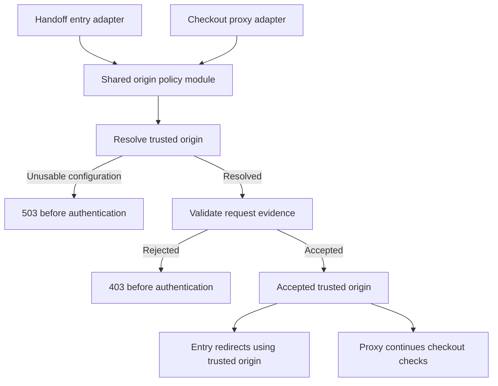

# Grilling Session — Shared Handoff Origin Policy

Date: 2026-10-06

Status: Behavior decisions accepted; implementation pending. Application behavior has not changed.

## Problem

The handoff entry route and checkout proxy independently implement request-origin policy. They differ when `NEXTAUTH_URL` is malformed. The entry route also constructs its redirect destination from request evidence rather than the resolved trusted origin.

## Accepted decisions

1. An explicitly configured but malformed `NEXTAUTH_URL` rejects handoff requests in all environments. Do not fall back to request headers or the request URL.
2. Missing `NEXTAUTH_URL` permits request-URL-origin fallback only in local development. Production rejects missing configuration. Tests should supply explicit configuration or explicitly exercise the local-development case.
3. A supplied `Origin` must be valid and match the trusted origin. If `Referer` is also supplied, it must be valid and match too. A supplied `Referer` without `Origin` must likewise be valid and match.
4. `Sec-Fetch-Site: same-origin` is sufficient only when both `Origin` and `Referer` are absent. Explicit `Origin: null`, empty or malformed origin evidence rejects; it does not count as absence.
5. The checkout redirect always uses the resolved trusted origin with `/checkout/passengers`. `Origin` and `Referer` are validation evidence only, never destination sources.
6. Trusted-origin configuration failures return `503 Service Unavailable`; rejected request evidence returns `403 Forbidden`. Both paths stop before authentication and backend calls and return non-cacheable responses.

## Module ownership

Reuse the existing handoff request policy module rather than introducing a second policy implementation. Its interface must convey an accepted trusted origin or a failure category, because a boolean cannot support the accepted redirect and status decisions. Keep trace-header handling separate from origin decisions.

The entry and proxy adapters retain their response bodies and downstream responsibilities. They consume the same origin policy and map its two failure categories consistently. Token resolution, session checks, handoff-cookie behavior, readiness evaluation, and Booking Intent creation retain their existing owners.

## Trade-off

Explicit trusted-origin configuration in production makes deployment mistakes visible and can temporarily block checkout. Silent fallback would preserve availability by changing the trust source; the accepted policy rejects that trade-off. Local-development fallback remains available without weakening production behavior.

## Verification required for implementation

- Shared policy cases: valid configuration, malformed explicit configuration in every environment, missing configuration in development and production, and explicit configuration in tests.
- Header cases: matching and mismatched origins; matching, mismatched and malformed referers; conflicting Origin/Referer; explicit null and empty evidence; absent evidence with same-origin, cross-site or missing Fetch Metadata.
- Adapter regressions: consistent 503/403, non-cacheable responses, and no authentication/backend calls on policy failures.
- Redirect regression: scheme, host and port derive from the accepted trusted origin; path is `/checkout/passengers`, without handoff credentials in the URL.
- Preserve existing handoff token, cookie, payload and trace tests; run focused web tests, typecheck and package lint.

No application tests were executed during this interview.
